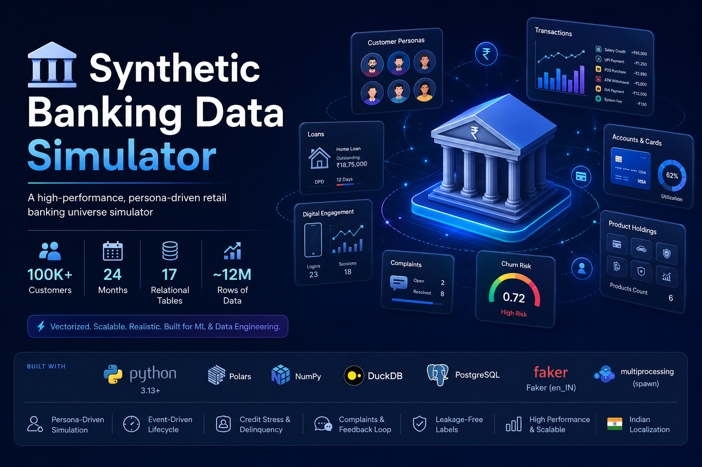
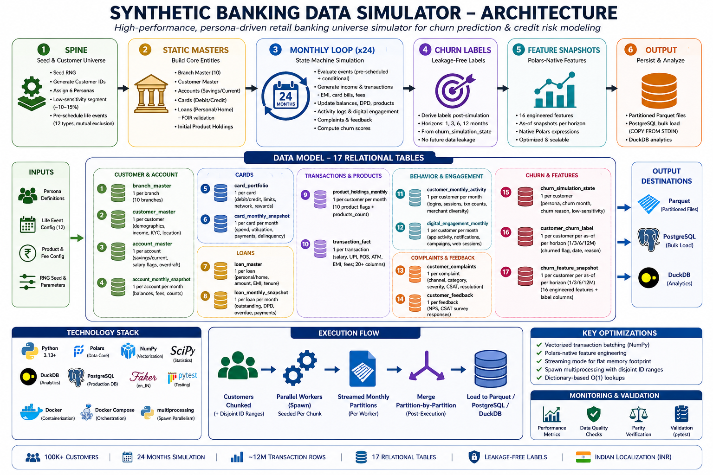

# Synthetic Banking Data Simulator



A high-performance, persona-driven retail banking universe simulator that generates realistic synthetic data for churn prediction modeling, credit risk analysis, and data engineering benchmarks. Models 100,000+ customers over 24 months with ~12 million rows of transactional, behavioral, and event-driven data.

## Key Features

**Persona-Driven Customer Profiles** — 6 distinct personas (Salary Core, Affluent Multi-Product, Digital Native, Credit Stressed, Dormant Wealthy, Complaint-Prone Churner) each with unique income distributions, spending patterns, digital engagement, complaint propensity, and churn sensitivity.

**Event-Driven Lifecycle** — Dynamically simulates 12 life/banking events (job change, salary delay, marriage, relocation, service failure, card decline spikes, etc.) that temporally impact customer behavior and satisfaction.

**Credit Stress & Delinquency** — Realistic EMI payment tracking, DPD (Days Past Due) counters, FOIR (Fixed Obligation to Income Ratio) checks for loan origination, and natural credit default trajectories.

**Vectorized Transaction Generation** — Batch-generated salary credits, irregular income, POS spends, UPI payments, ATM withdrawals, loan repayments, and system fees using NumPy vectorized operations.

**Complaints & Feedback Loop** — Dynamic complaint generation tied to events, severity-graded resolution timelines, CSAT scores, and NPS feedback surveys with persona-dependent baselines.

**Multi-Factor Churn Model** — Continuous churn risk scoring via a weighted component formula (event impact, complaint volume, loan stress, digital inactivity, product engagement) with Gaussian noise and hard triggers (90+ DPD, salary loss, account dormancy).

**Leakage-Free Labels** — Post-simulation label derivation across 4 prediction horizons (1, 3, 6, 12 months) ensuring no future data leaks into as-of feature windows.

**17 Relational Tables** — Full banking schema: customer/account/card/loan masters, monthly snapshots, transaction fact table, product holdings, activity logs, digital engagement, complaints, feedback, churn state, labels, and features.

**Indian Localization** — Faker-based Indian names (en_IN), weighted metro/urban branch distribution, INR currency, Indian merchant names (BigBasket, Zepto, Zomato, IRCTC, etc.).

## Performance

The simulator is built for speed with heavy NumPy vectorization, Polars-native feature computation, streaming memory management, and parallel multiprocessing.

| Benchmark                                            | Metric                      |
| ---------------------------------------------------- | --------------------------- |
| **100K customers, 24 months** (4-core Ryzen 5 3550H) | **254 seconds** (~12M rows) |
| **Parquet merge (all partitioned files)**            | **~10 seconds**             |

Key optimizations:

- **Vectorized transaction batching** (`perf(transaction)`) — replaces per-customer Python loops with batched NumPy operations for regular debits and non-salary credits
- **Polars-native feature engineering** (`perf(features)`) — rewrote `churn_feature_snapshot` generation using native Polars expressions instead of row-wise iteration
- **Streaming mode** (`perf(cli)`) — auto-enables streaming Parquet writes during parallel runs to maintain flat memory footprint and avoid OOMs
- **Spawn multiprocessing** (`feat(pipeline)`) — uses `multiprocessing` spawn context with partitioned customer chunks and pre-computed disjoint ID ranges for near-linear scaling
- **Dictionary-based O(1) lookups** — index maps for accounts/cards/loans/complaints by customer ID to avoid repeated scanning

## Architecture

```
Spine Generation ──► Static Masters ──► Monthly Loop (x24) ──► Churn Labels ──► Parquet/DB
                        │                     │
                   branches, customers     transactions, snapshots,
                   accounts, cards,        complaints, feedback,
                   loans, products         activity, digital engagement
```



**6-phase pipeline:**

1. **Spine** — Seeds RNG, generates customer IDs, assigns personas uniformly, samples low-sensitivity segment (~10-15%), pre-schedules unconditional life events with mutual exclusion
2. **Static Masters** — Branch master (10 Indian branches), customer master (Faker names, ages, incomes, locations), initial product holdings, Savings/Current accounts, Debit/Credit cards, Personal/Home loans with FOIR validation
3. **Monthly Loop** — 24-month state machine: evaluates pre-scheduled + conditional events, generates salary/non-salary income, regular debit transactions, EMI payments, credit card bills, system fees; updates running balances, DPD counters, product holdings; generates activity logs, digital engagement, complaints, feedback surveys; computes churn scores
4. **Churn Labels** — Post-simulation derivation of `customer_churn_label` across (1, 3, 6, 12)-month horizons from the ground-truth `churn_simulation_state`
5. **Feature Snapshots** — Computes 16 engineered features via native Polars expressions: tenure, product count, balance/txn/login trends, complaint counts, salary consistency, credit utilization, EMI-to-income ratio, dormant days, NPS average, campaign response rate, product acquisition velocity
6. **Output** — Partitioned Parquet files + PostgreSQL bulk load (COPY FROM STDIN) + DuckDB in-memory analytics

## 17 Output Tables

| Table                        | Grain                                | Description                                              |
| ---------------------------- | ------------------------------------ | -------------------------------------------------------- |
| `branch_master`              | 1 per branch                         | 10 branches across Indian metros/urban cities            |
| `customer_master`            | 1 per customer                       | Demographics, income, KYC, location                      |
| `account_master`             | 1 per account                        | Savings/Current accounts, salary flags, overdraft        |
| `account_monthly_snapshot`   | 1 per account per month              | Balance metrics, deposit/withdrawal counts, fees         |
| `card_portfolio`             | 1 per card                           | Debit/Credit cards, network, rewards tier, credit limits |
| `card_monthly_snapshot`      | 1 per card per month                 | Spend, utilization rate, payments, delinquency           |
| `loan_master`                | 1 per loan                           | Personal/Home loans, sanctioned amount, EMI, tenure      |
| `loan_monthly_snapshot`      | 1 per loan per month                 | Outstanding, DPD, overdue, principal/interest paid       |
| `product_holdings_monthly`   | 1 per customer per month             | 10 product flags + products_count                        |
| `transaction_fact`           | 1 per transaction                    | Salary, UPI, POS, ATM, EMI, fees; 20+ columns            |
| `customer_monthly_activity`  | 1 per customer per month             | Logins, sessions, txn counts, merchant diversity         |
| `digital_engagement_monthly` | 1 per customer per month             | App activity, notifications, campaigns, web sessions     |
| `customer_complaints`        | 1 per complaint                      | Channel, category, severity, CSAT, resolution            |
| `customer_feedback`          | 1 per feedback                       | NPS, CSAT survey responses                               |
| `churn_simulation_state`     | 1 per customer                       | Persona, churn month, churn reason, low-sensitivity flag |
| `customer_churn_label`       | 1 per customer per as-of per horizon | Churned flag, date, reason for 1/3/6/12 month horizons   |
| `churn_feature_snapshot`     | 1 per customer per as-of per horizon | 16 engineered features + label columns                   |

## Technology Stack

| Component            | Tool                                        |
| -------------------- | ------------------------------------------- |
| **Runtime**          | Python 3.13+                                |
| **Data Core**        | Polars, NumPy, SciPy                        |
| **Databases**        | DuckDB (analytics), PostgreSQL (production) |
| **Concurrency**      | multiprocessing (spawn)                     |
| **Localization**     | Faker (en_IN)                               |
| **Validation**       | pytest                                      |
| **Containerization** | Docker, Docker Compose                      |

## Quickstart

### Setup

```bash
uv venv
source .venv/bin/activate
uv pip install -e .
```

### Generate data

```bash
# Quick validation run (2K customers, 4 cores)
PYTHONPATH=. uv run python main.py --n-customers 2000 --sim-months 24 --jobs 4 --duckdb-db data/bank_data_final.db

# Full run (10K customers, 8 cores)
PYTHONPATH=. uv run python main.py --n-customers 10000 --sim-months 24 --jobs 8 --duckdb-db data/bank_data_final.db

# Production run (100K customers, all cores)
PYTHONPATH=. uv run python main.py --n-customers 100000 --sim-months 24 --jobs $(nproc) --duckdb-db data/bank_data_final.db
```

### Validate output

```bash
PYTHONPATH=. uv run python pipeline/validate.py --db data/bank_data_final.db
```

### Materialize features (SQL)

```bash
duckdb temp-test/bank_data.db < features/build_features.sql
```

### Run tests

```bash
PYTHONPATH=. uv run pytest
```

### Verify parity (baseline vs optimized)

```bash
PYTHONPATH=. uv run python pipeline/verify_parity.py
```

## Docker

```bash
docker compose up --build
```

Launches PostgreSQL 15, waits for health check, runs simulator, loads 1K customers into PostgreSQL, writes Parquet to `./data/`.

## CLI Reference

| Argument         | Default    | Description                          |
| ---------------- | ---------- | ------------------------------------ |
| `--n-customers`  | 1000       | Number of customers                  |
| `--sim-months`   | 24         | Simulation duration                  |
| `--seed`         | 42         | RNG seed                             |
| `--output-dir`   | ./data/raw | Parquet output directory             |
| `--postgres-uri` | —          | PostgreSQL connection URI (optional) |
| `--duckdb-db`    | —          | DuckDB file path (optional)          |
| `--jobs`         | 1          | Parallel worker count                |

## Parallel Execution

The `--jobs` flag splits customers into evenly sized chunks with pre-computed disjoint ID ranges for accounts, cards, loans, transactions, complaints, and feedback. Each chunk runs in a separate `spawn` process with its own seed (base_seed + chunk_index). Streamed monthly partitions are merged partition-by-partition post-execution. Forces streaming mode automatically to maintain flat memory.

## Personas

| Persona                 | Income     | Digital Engagement | Complaint Rate | Base Monthly Churn |
| ----------------------- | ---------- | ------------------ | -------------- | ------------------ |
| Salary Core             | ₹3L–₹12L   | High               | Low            | 0.3%–1.0%          |
| Affluent Multi-Product  | ₹12L–₹60L  | Medium-High        | Low            | 0.1%–0.6%          |
| Digital Native          | ₹4L–₹20L   | Very High          | Low-Medium     | 0.2%–0.8%          |
| Credit Stressed         | ₹2.5L–₹10L | Medium             | High           | 1.0%–3.0%          |
| Dormant Wealthy         | ₹15L–₹1Cr  | Low                | Low            | 0.4%–1.5%          |
| Complaint-Prone Churner | ₹3L–₹15L   | Medium             | Very High      | 2.0%–5.0%          |

## Churn Modeling

**Score formula:** `base_rate + weighted(event, trend, product, complaint, loan_stress, digital_inactivity) + Gaussian noise` → sigmoid → Bernoulli trial (or threshold-based).

**Hard triggers** (churn probability = 1.0):

- Loan delinquent with DPD ≥ 90 days
- 4+ complaints in 6 months with 2+ unresolved
- Balance < ₹500 with 3+ months without salary
- 2+ service failures with 2+ months digital inactivity

**Churn reasons** (priority order): Loan default → Salary account lost → Service dissatisfaction → Account dormancy → Product disengagement → Service failure → Voluntary closure.
