# Churn Compass Synthetic Banking Data Generator

## Implementation Spec v1

This document is the implementation-ready specification for the synthetic retail banking data generator used to support Churn Compass.

---

## 1. Scope

This generator creates a realistic synthetic banking universe with:

- customer master data
- account and card portfolios
- loan lifecycle snapshots
- monthly activity and digital engagement
- complaints and feedback
- churn ground truth
- derived churn labels for modeling

The generator is **not** part of the Churn Compass product runtime. It is a separate development/data creation system.

---

## 2. Core design rules

### 2.1 Grain rules

- `customer_master`: 1 row per customer
- `account_master`: 1 row per account
- `account_monthly_snapshot`: 1 row per account per month
- `card_portfolio`: 1 row per card
- `card_monthly_snapshot`: 1 row per card per month
- `loan_master`: 1 row per loan
- `loan_monthly_snapshot`: 1 row per loan per month
- `product_holdings_monthly`: 1 row per customer per month
- `transaction_fact`: 1 row per transaction
- `customer_monthly_activity`: 1 row per customer per month
- `digital_engagement_monthly`: 1 row per customer per month
- `customer_complaints`: 1 row per complaint
- `customer_feedback`: 1 row per feedback response
- `churn_simulation_state`: 1 row per customer
- `customer_churn_label`: 1 row per customer per as-of month per horizon
- `churn_feature_snapshot`: 1 row per customer per as-of month per horizon

### 2.2 Time handling

- Store monthly snapshots using `snapshot_month DATE` as the first day of the month.
- Store transaction timestamps in UTC or a fixed timezone.
- Never leak future data into an earlier as-of month.

### 2.3 Simulation principle

- Generate a hidden customer spine first.
- Generate monthly behavior from the spine.
- Derive churn month during the simulation.
- Derive labels afterward.

---

## 3. Repository structure

```text
churn_compass_generator/
├── config/
│   ├── personas.py
│   ├── events.py
│   ├── simulation.py
│   └── constants.py
├── generators/
│   ├── spine.py
│   ├── customers.py
│   ├── accounts.py
│   ├── cards.py
│   ├── loans.py
│   ├── products.py
│   ├── transactions.py
│   ├── activity.py
│   ├── digital.py
│   ├── complaints.py
│   ├── feedback.py
│   ├── churn.py
│   └── labels.py
├── pipeline/
│   ├── simulate.py
│   ├── writer.py
│   ├── loader.py
│   └── validate.py
├── features/
│   └── build_features.sql
└── tests/
    ├── test_personas.py
    ├── test_events.py
    ├── test_churn.py
    └── test_schema.py
```

---

## 4. Technology stack

### Required

- Python 3.13+
- NumPy
- SciPy
- Faker
- PyArrow
- Polars
- DuckDB
- Pydantic
- PostgreSQL
- Docker / Docker Compose

### Optional

- pandas for inspection only
- Loguru or stdlib logging
- Prefect for orchestration

### Not required for v1

- Spark
- Kafka
- SDV as the primary generator

---

## 5. Persona model

Use 6 personas.

### 5.1 Persona enum

```python
class Persona(str, Enum):
    SALARY_CORE = "salary_core"
    AFFLUENT_MULTI_PRODUCT = "affluent_multi_product"
    DIGITAL_NATIVE = "digital_native"
    CREDIT_STRESSED = "credit_stressed"
    DORMANT_WEALTHY = "dormant_wealthy"
    COMPLAINT_PRONE_CHURNER = "complaint_prone_churner"
```

### 5.2 Persona config fields

Each persona must define:

- `income_mu`
- `income_sigma`
- `income_clip_min`
- `income_clip_max`
- `digital_engagement_beta_a`
- `digital_engagement_beta_b`
- `complaint_rate_min`
- `complaint_rate_max`
- `base_monthly_churn_min`
- `base_monthly_churn_max`
- `product_uptake_probs`
- `loan_propensity`
- `cash_pref`
- `branch_pref`
- `low_sensitivity_share`

### 5.3 Persona parameter ranges

| Persona                 | Annual income range | Digital engagement | Complaint propensity | Base monthly churn |
| ----------------------- | ------------------: | -----------------: | -------------------: | -----------------: |
| salary_core             |            ₹3L–₹12L |               high |                  low |          0.3%–1.0% |
| affluent_multi_product  |           ₹12L–₹60L |        medium-high |                  low |          0.1%–0.6% |
| digital_native          |            ₹4L–₹20L |          very high |           low-medium |          0.2%–0.8% |
| credit_stressed         |          ₹2.5L–₹10L |             medium |                 high |          1.0%–3.0% |
| dormant_wealthy         |           ₹15L–₹1Cr |                low |                  low |          0.4%–1.5% |
| complaint_prone_churner |            ₹3L–₹15L |             medium |            very high |          2.0%–5.0% |

### 5.4 Product uptake probabilities

These apply at initial portfolio creation and at cross-sell events.

| Product       | salary_core | affluent_multi_product | digital_native | credit_stressed | dormant_wealthy | complaint_prone_churner |
| ------------- | ----------: | ---------------------: | -------------: | --------------: | --------------: | ----------------------: |
| savings       |        0.98 |                   0.97 |           0.96 |            0.94 |            0.95 |                    0.93 |
| current       |        0.20 |                   0.35 |           0.15 |            0.10 |            0.12 |                    0.10 |
| debit_card    |        0.95 |                   0.90 |           0.92 |            0.85 |            0.80 |                    0.78 |
| credit_card   |        0.35 |                   0.55 |           0.30 |            0.65 |            0.25 |                    0.45 |
| personal_loan |        0.10 |                   0.08 |           0.12 |            0.45 |            0.03 |                    0.20 |
| home_loan     |        0.08 |                   0.30 |           0.04 |            0.12 |            0.18 |                    0.05 |
| fixed_deposit |        0.22 |                   0.80 |           0.10 |            0.12 |            0.88 |                    0.15 |
| insurance     |        0.20 |                   0.75 |           0.12 |            0.08 |            0.70 |                    0.10 |
| mutual_fund   |        0.12 |                   0.78 |           0.18 |            0.06 |            0.72 |                    0.08 |
| demat_account |        0.08 |                   0.35 |           0.20 |            0.05 |            0.18 |                    0.06 |

### 5.5 Low-sensitivity segment

- Assign `low_sensitivity_segment` to approximately 10%–15% of customers.
- This is not immunity.
- It means lower churn slope and stronger resistance to isolated adverse events.

---

## 6. Hidden event model

### 6.1 Event enum

```python
class HiddenEvent(str, Enum):
    SALARY_JOB_CHANGE = "salary_job_change"
    SALARY_DELAY = "salary_delay"
    LARGE_LIFE_EXPENSE = "large_life_expense"
    HOME_PURCHASE = "home_purchase"
    MARRIAGE_OR_FAMILY_CHANGE = "marriage_or_family_change"
    RELOCATION = "relocation"
    BANK_SERVICE_FAILURE = "bank_service_failure"
    CARD_DECLINE_SPIKE = "card_decline_spike"
    FEE_HIKE_OR_SERVICE_CHARGE = "fee_hike_or_service_charge"
    CAMPAIGN_EXPOSURE = "campaign_exposure"
    LOAN_DELINQUENCY_START = "loan_delinquency_start"
    COMPLAINT_RESOLVED = "complaint_resolved"
```

### 6.2 Event classes

#### Unconditional events

Pre-assign during spine generation.

- salary_job_change
- salary_delay
- large_life_expense
- home_purchase
- marriage_or_family_change
- relocation
- bank_service_failure
- fee_hike_or_service_charge

#### Conditional events

Only fire if prerequisites exist at simulation time.

- card_decline_spike
- campaign_exposure
- loan_delinquency_start
- complaint_resolved

### 6.3 Event scheduling rule

- Pre-assign only unconditional events.
- Resolve conditional events month-by-month.
- Apply mutual exclusion where events collide on the same primary cause.

### 6.4 Campaign rule

`campaign_exposure` is a single event that produces one of two outcomes:

- success
- failure

Success and failure are not separate independent events.

---

## 7. Event probability table

The monthly trigger probability depends on persona.

| Event                      | salary_core | affluent_multi_product | digital_native | credit_stressed | dormant_wealthy | complaint_prone_churner |
| -------------------------- | ----------: | ---------------------: | -------------: | --------------: | --------------: | ----------------------: |
| salary_job_change          |        1.5% |                   1.0% |           1.0% |            2.0% |            0.5% |                    1.5% |
| salary_delay               |        3.0% |                   2.0% |           2.0% |            4.0% |            1.0% |                    3.0% |
| large_life_expense         |        2.0% |                   4.0% |           2.0% |            5.0% |            2.0% |                    3.0% |
| home_purchase              |        0.4% |                   1.2% |           0.3% |            0.6% |            0.8% |                    0.2% |
| marriage_or_family_change  |        0.8% |                   1.0% |           0.7% |            0.8% |            0.6% |                    0.7% |
| relocation                 |        0.6% |                   0.7% |           0.8% |            1.0% |            1.0% |                    0.8% |
| bank_service_failure       |        2.0% |                   2.0% |           3.0% |            3.0% |            1.0% |                    4.0% |
| card_decline_spike         |        1.0% |                   1.0% |           1.5% |            3.0% |            0.5% |                    2.0% |
| fee_hike_or_service_charge |        2.0% |                   1.0% |           2.0% |            4.0% |            1.0% |                    4.0% |
| campaign_exposure          |       10.0% |                  15.0% |          12.0% |            8.0% |           10.0% |                    6.0% |
| loan_delinquency_start     |        0.5% |                   0.3% |           0.5% |            4.0% |            0.2% |                    1.0% |

---

## 8. Event propagation rules

### 8.1 Salary job change

Effects:

- salary credits become irregular or change amount
- account balance volatility increases
- login frequency may decrease slightly
- credit utilization may rise
- complaint risk may rise if payroll linkage breaks

Affected tables:

- `transaction_fact`
- `account_monthly_snapshot`
- `customer_monthly_activity`
- `digital_engagement_monthly`
- `customer_feedback`

### 8.2 Salary delay

Effects:

- salary credit amount may be missing or late
- total credit amount drops for the month
- short-term balance stress increases
- complaints may rise

Affected tables:

- `transaction_fact`
- `account_monthly_snapshot`
- `customer_monthly_activity`
- `customer_complaints`

### 8.3 Large life expense

Effects:

- balance drops
- debit transactions spike
- card utilization rises
- loan or EMI stress may rise

Affected tables:

- `transaction_fact`
- `account_monthly_snapshot`
- `card_monthly_snapshot`
- `customer_monthly_activity`
- `loan_monthly_snapshot`

### 8.4 Bank service failure

Effects:

- complaints spike
- NPS and CSAT fall
- digital activity drops in the next month
- churn risk increases sharply

Affected tables:

- `customer_complaints`
- `customer_feedback`
- `digital_engagement_monthly`
- `customer_monthly_activity`

### 8.5 Fee hike or service charge

Effects:

- small balance erosion
- complaints increase
- churn risk rises for fee-sensitive customers

Affected tables:

- `transaction_fact`
- `customer_complaints`
- `account_monthly_snapshot`

### 8.6 Campaign exposure

Success:

- product uptake may increase
- digital response improves
- churn risk falls

Failure:

- no new product uptake
- response remains weak
- churn risk may rise slightly

Affected tables:

- `product_holdings_monthly`
- `digital_engagement_monthly`
- `customer_monthly_activity`

### 8.7 Loan delinquency start

Effects:

- DPD begins increasing
- overdue amount appears
- churn risk rises strongly

Affected tables:

- `loan_monthly_snapshot`
- `customer_complaints`
- `customer_monthly_activity`
- `customer_churn_label`

---

## 9. Churn scoring model

### 9.1 Score formula

For each customer-month:

```python
churn_risk = base_rate
           + event_score
           + trend_score
           + product_score
           + complaint_score
           + loan_stress_score
           + digital_inactivity_score
           + noise
```

Then apply either:

```python
churn_prob = sigmoid(churn_risk)
churned = Bernoulli(churn_prob)
```

or a thresholded variant if deterministic labels are needed.

### 9.2 Recommended noise definition

Use a tunable Gaussian term:

```python
noise = np.random.normal(0, sigma_persona)
```

Suggested `sigma_persona` range:

- low-risk personas: 0.05 to 0.08
- high-risk personas: 0.08 to 0.12

Add a small month-to-month random walk if needed.

### 9.3 Churn thresholds by persona

| Persona                 | Threshold |
| ----------------------- | --------: |
| salary_core             |      0.72 |
| affluent_multi_product  |      0.78 |
| digital_native          |      0.70 |
| credit_stressed         |      0.58 |
| dormant_wealthy         |      0.74 |
| complaint_prone_churner |      0.55 |

### 9.4 Hard triggers

These override the normal score path.

- `loan_status = "Delinquent"` with `dpd_days >= 90`
- `complaint_count_6m >= 4` and `unresolved_complaints >= 2`
- `current_balance < 500` and no salary credit for 3 months
- repeated service failure plus inactive digital use for 2 months
- closure of core operating account if modeled

### 9.5 Churn stop rule

After churn month is reached:

- stop generating normal future activity
- optionally generate a short tail of dormant/noisy residual behavior for 1–2 months
- do not keep the customer in a healthy state after churn

---

## 10. Churn reason mapping

`churn_reason` must be derived from a priority rule.

### Priority order

1. Loan default / delinquency
2. Salary account loss
3. Complaint-driven dissatisfaction
4. Balance exhaustion / account dormancy
5. Product disengagement
6. Service failure
7. Voluntary closure

### Reason assignment logic

Example mapping:

- if `dpd_days >= 90` or `loan_status == "Delinquent"` → `"Loan default"`
- if salary stopped and `salary_job_change` occurred recently → `"Salary account lost"`
- if complaints are high and unresolved → `"Service dissatisfaction"`
- if balance is near zero and activity is low → `"Account dormancy"`
- if products_count dropped materially → `"Product disengagement"`
- if recent bank service failure followed by complaint spike → `"Service failure"`
- else → `"Voluntary closure"`

---

## 11. Derived label contract

### 11.1 Ground truth output

Simulation must emit:

```text
churn_simulation_state
```

with at least:

- `customer_id`
- `persona`
- `churn_month`
- `churned_flag`
- `churn_reason`
- `low_sensitivity_segment`

### 11.2 Training label output

Derive `customer_churn_label` from the simulation state.

**Grain:** `(customer_id, as_of_month, prediction_horizon_months)`

Fields:

- `customer_id`
- `as_of_month`
- `prediction_horizon_months`
- `churned`
- `churn_date`
- `churn_reason`

### 11.3 Label generation rule

For each as-of month and horizon:

- `churned = true` if `churn_month` is within `(as_of_month, as_of_month + horizon]`
- otherwise `false`

This label table is a post-processing artifact and should not be written directly by the monthly simulation loop.

---

## 12. Tables and exact columns

### 12.1 `customer_master`

**Grain:** 1 row per customer

- `customer_id BIGINT`
- `cif_number VARCHAR(20)`
- `first_name VARCHAR(100)`
- `last_name VARCHAR(100)`
- `date_of_birth DATE`
- `gender VARCHAR(20)`
- `marital_status VARCHAR(20)`
- `occupation VARCHAR(100)`
- `employment_type VARCHAR(50)`
- `annual_income NUMERIC(18,2)`
- `customer_since DATE`
- `city VARCHAR(100)`
- `state VARCHAR(100)`
- `country VARCHAR(100)`
- `kyc_status VARCHAR(20)`
- `is_active BOOLEAN`

### 12.2 `branch_master`

**Grain:** 1 row per branch

- `branch_code VARCHAR(20)`
- `branch_name VARCHAR(100)`
- `city VARCHAR(100)`
- `state VARCHAR(100)`
- `region VARCHAR(50)`
- `branch_type VARCHAR(30)`
- `open_date DATE`
- `closure_date DATE NULL`

### 12.3 `account_master`

**Grain:** 1 row per account

- `account_id BIGINT`
- `customer_id BIGINT`
- `branch_code VARCHAR(20)`
- `account_type VARCHAR(50)`
- `open_date DATE`
- `account_status VARCHAR(20)`
- `account_currency VARCHAR(3)`
- `salary_account_flag BOOLEAN`
- `overdraft_limit NUMERIC(18,2)`
- `account_close_date DATE NULL`

### 12.4 `account_monthly_snapshot`

**Grain:** 1 row per account per month

- `account_id BIGINT`
- `snapshot_month DATE`
- `current_balance NUMERIC(18,2)`
- `average_monthly_balance NUMERIC(18,2)`
- `min_balance_30d NUMERIC(18,2)`
- `max_balance_30d NUMERIC(18,2)`
- `deposit_count INT`
- `withdrawal_count INT`
- `debit_txn_count INT`
- `credit_txn_count INT`
- `fee_charged_amount NUMERIC(18,2)`
- `salary_credit_amount NUMERIC(18,2)`
- `account_status VARCHAR(20)`

### 12.5 `card_portfolio`

**Grain:** 1 row per card

- `card_id BIGINT`
- `customer_id BIGINT`
- `card_type VARCHAR(20)`
- `network VARCHAR(20)`
- `issue_date DATE`
- `expiry_date DATE`
- `card_status VARCHAR(20)`
- `primary_card_flag BOOLEAN`
- `credit_limit NUMERIC(18,2)`
- `rewards_program VARCHAR(50)`
- `reward_tier VARCHAR(20)`

### 12.6 `card_monthly_snapshot`

**Grain:** 1 row per card per month

- `card_id BIGINT`
- `snapshot_month DATE`
- `monthly_spend_amount NUMERIC(18,2)`
- `monthly_txn_count INT`
- `cash_advance_amount NUMERIC(18,2)`
- `utilization_rate NUMERIC(6,4)`
- `min_due_amount NUMERIC(18,2)`
- `payment_made_amount NUMERIC(18,2)`
- `rewards_points_balance BIGINT`
- `card_status VARCHAR(20)`
- `delinquency_flag BOOLEAN`

### 12.7 `loan_master`

**Grain:** 1 row per loan

- `loan_id BIGINT`
- `customer_id BIGINT`
- `branch_code VARCHAR(20)`
- `loan_type VARCHAR(50)`
- `sanctioned_amount NUMERIC(18,2)`
- `disbursement_date DATE`
- `interest_rate NUMERIC(6,3)`
- `tenure_months INT`
- `emi_amount NUMERIC(18,2)`
- `loan_purpose VARCHAR(100)`
- `origination_channel VARCHAR(50)`
- `loan_status VARCHAR(20)`
- `maturity_date DATE`

### 12.8 `loan_monthly_snapshot`

**Grain:** 1 row per loan per month

- `loan_id BIGINT`
- `snapshot_month DATE`
- `outstanding_balance NUMERIC(18,2)`
- `emi_amount NUMERIC(18,2)`
- `dpd_days INT`
- `overdue_amount NUMERIC(18,2)`
- `principal_paid_amount NUMERIC(18,2)`
- `interest_paid_amount NUMERIC(18,2)`
- `installment_due_amount NUMERIC(18,2)`
- `installment_paid_amount NUMERIC(18,2)`
- `loan_status VARCHAR(20)`
- `restructuring_flag BOOLEAN`

### 12.9 `product_holdings_monthly`

**Grain:** 1 row per customer per month

- `customer_id BIGINT`
- `snapshot_month DATE`
- `savings_account_flag BOOLEAN`
- `current_account_flag BOOLEAN`
- `credit_card_flag BOOLEAN`
- `personal_loan_flag BOOLEAN`
- `home_loan_flag BOOLEAN`
- `fixed_deposit_flag BOOLEAN`
- `insurance_flag BOOLEAN`
- `mutual_fund_flag BOOLEAN`
- `demat_account_flag BOOLEAN`
- `wealth_management_flag BOOLEAN`
- `products_count INT`

### 12.10 `transaction_fact`

**Grain:** 1 row per transaction

- `transaction_id BIGINT`
- `account_id BIGINT`
- `customer_id BIGINT`
- `txn_timestamp TIMESTAMP`
- `txn_date DATE`
- `txn_month DATE`
- `txn_type VARCHAR(50)`
- `direction VARCHAR(10)`
- `channel VARCHAR(30)`
- `amount NUMERIC(18,2)`
- `currency VARCHAR(3)`
- `merchant_category VARCHAR(100)`
- `merchant_name VARCHAR(150)`
- `counterparty_type VARCHAR(50)`
- `city VARCHAR(100)`
- `state VARCHAR(100)`
- `is_salary_credit BOOLEAN`
- `is_fee BOOLEAN`
- `is_reversal BOOLEAN`
- `balance_after_txn NUMERIC(18,2)`

### 12.11 `customer_monthly_activity`

**Grain:** 1 row per customer per month

- `customer_id BIGINT`
- `snapshot_month DATE`
- `login_count INT`
- `mobile_app_sessions INT`
- `internet_banking_sessions INT`
- `atm_transactions INT`
- `branch_visits INT`
- `debit_txn_count INT`
- `credit_txn_count INT`
- `total_debit_amount NUMERIC(18,2)`
- `total_credit_amount NUMERIC(18,2)`
- `avg_transaction_value NUMERIC(18,2)`
- `unique_merchants INT`
- `cash_withdrawal_count INT`
- `card_present_txn_count INT`
- `card_not_present_txn_count INT`
- `days_since_last_txn INT`
- `days_since_last_login INT`

### 12.12 `digital_engagement_monthly`

**Grain:** 1 row per customer per month

- `customer_id BIGINT`
- `snapshot_month DATE`
- `mobile_app_active BOOLEAN`
- `last_login_date DATE`
- `push_notifications_sent INT`
- `push_notifications_opened INT`
- `email_campaigns_sent INT`
- `email_clicks INT`
- `campaigns_received INT`
- `campaigns_responded INT`
- `web_sessions INT`
- `notification_opt_in BOOLEAN`
- `app_crash_count INT`

### 12.13 `customer_complaints`

**Grain:** 1 row per complaint

- `complaint_id BIGINT`
- `customer_id BIGINT`
- `complaint_date DATE`
- `complaint_month DATE`
- `channel VARCHAR(50)`
- `category VARCHAR(100)`
- `severity VARCHAR(20)`
- `resolution_days INT`
- `resolved_flag BOOLEAN`
- `escalated_flag BOOLEAN`
- `csat_score INT`
- `root_cause VARCHAR(100)`
- `status VARCHAR(20)`

### 12.14 `customer_feedback`

**Grain:** 1 row per feedback response

- `feedback_id BIGINT`
- `customer_id BIGINT`
- `feedback_date DATE`
- `feedback_month DATE`
- `survey_channel VARCHAR(50)`
- `survey_topic VARCHAR(100)`
- `nps_score INT`
- `csat_score INT`

### 12.15 `churn_simulation_state`

**Grain:** 1 row per customer

- `customer_id BIGINT`
- `persona VARCHAR(50)`
- `low_sensitivity_segment BOOLEAN`
- `churn_month DATE NULL`
- `churned_flag BOOLEAN`
- `churn_reason VARCHAR(100) NULL`
- `active_months_generated INT`

### 12.16 `customer_churn_label`

**Grain:** 1 row per customer per as-of month per horizon

- `customer_id BIGINT`
- `as_of_month DATE`
- `prediction_horizon_months INT`
- `churned BOOLEAN`
- `churn_date DATE NULL`
- `churn_reason VARCHAR(100) NULL`

### 12.17 `churn_feature_snapshot`

**Grain:** 1 row per customer per as-of month per horizon

Store engineered features plus label fields.

Core features to include:

- `tenure_months`
- `products_count`
- `balance_change_3m`
- `txn_count_change_3m`
- `login_count_change_6m`
- `complaint_count_6m`
- `unresolved_complaints`
- `days_since_last_login`
- `salary_credit_consistency`
- `credit_utilization`
- `emi_to_income_ratio`
- `dormant_days`
- `nps_avg_12m`
- `campaign_response_rate`
- `product_acquisition_velocity_6m`
- label columns from `customer_churn_label`

---

## 13. Pipeline order

### 13.1 Generation order

1. Generate `branch_master`
2. Generate `customer_master`
3. Assign persona and low-sensitivity segment
4. Generate `churn_simulation_state` spine
5. Generate `account_master`, `card_portfolio`, `loan_master`
6. Pre-assign unconditional hidden events
7. Run monthly simulation loop for 24 months
8. Generate monthly snapshots and transactions
9. Assign churn month if triggered
10. Derive `customer_churn_label`
11. Build `churn_feature_snapshot`
12. Load final datasets into PostgreSQL

### 13.2 Simulation loop rule

- Loop by month.
- Vectorize across all active customers for that month.
- Avoid nested customer-by-month Python loops.
- Stop normal generation after churn month.

---

## 14. Storage and transfer format

### Source of truth

Use **partitioned Parquet** as the portable source of truth.

Recommended layout:

```text
data/
  raw/
    customer_master.parquet
    account_master.parquet
    account_monthly_snapshot/
      snapshot_month=2024-01-01/part-*.parquet
    loan_monthly_snapshot/
      snapshot_month=2024-01-01/part-*.parquet
    transactions/
      txn_month=2024-01-01/part-*.parquet
```

### PostgreSQL

- Load final tables into PostgreSQL for app integration and querying.
- Keep SQL schema separate from generator code.

### Transferability

To move the dataset later:

- copy the Parquet directory
- or regenerate from the same seed/config
- or load from a versioned Docker volume

---

## 15. Validation rules

### 15.1 Schema validation

- non-null checks on PKs
- FK integrity checks
- monthly snapshot grain checks
- date monotonicity checks

### 15.2 Behavioral validation

- churn rate differs by persona
- low-sensitivity segment has lower churn slope
- complaint-prone persona shows more complaints
- wealthy dormant persona has low activity but can still churn
- campaign success increases product uptake
- loan delinquency increases churn materially

### 15.3 Leakage checks

- no feature uses post-label information
- no label-derived columns inside feature generation
- no future months included in as-of feature windows

---

## 16. Minimum viable v1 build

If implementation needs to start small, build only these first:

- `customer_master`
- `account_master`
- `account_monthly_snapshot`
- `product_holdings_monthly`
- `transaction_fact`
- `customer_monthly_activity`
- `digital_engagement_monthly`
- `customer_complaints`
- `churn_simulation_state`
- `customer_churn_label`
- `churn_feature_snapshot`

Keep `cards`, `loans`, and `feedback` as phase 2 if needed.

---

## 17. Implementation priority

1. Config objects for personas and events
2. Spine generation
3. Monthly simulation loop
4. Churn scoring
5. Label derivation
6. Feature snapshot build
7. Parquet writer
8. Postgres loader
9. Validation tests

---

## 18. Final rule

The generator should be:

- deterministic with a seed
- configurable through YAML or Python config objects
- explainable enough to debug
- noisy enough to avoid trivial model shortcuts
- simple enough to finish

This is the baseline spec for code generation.


## Build order


